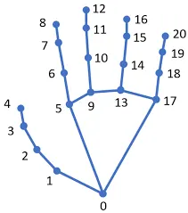

# Real-time Detection and Translation System for American Sign Language (ASL)

## Technologies
- **Python** - OpenCV2, Pandas, MediaPipe, OS, Sklearn, Toglib

## Context
This project originated from the need to create a technological solution that facilitates communication for individuals using ASL, as well as for those looking to learn this language. The goal is to bridge the gap between deaf or non-verbal individuals and the rest of society by providing an accessible and effective tool for visual communication. Through this project, we aim to promote inclusion and accessibility for all, recognizing the diversity of communication modes.

## American Sign Language "ASL"
ASL is much more than just a set of gestures. It is a complete language with its own grammar, syntax, and distinct vocabulary. Primarily used in the United States and Canada, ASL offers a means of expression for individuals whose vocal communication is limited or absent. Its richness and complexity make it a powerful mode of communication adaptable to a wide variety of contexts.

## Objectives
The main objectives of the ASL detection system are as follows:

- Development of a robust system capable of detecting ASL in real time
- Use of MediaPipe for extracting relevant hand points
- Design of a training and testing database
- Creation of the Machine Learning model
- Testing the model
- Providing an intuitive user interface to interact with the system

---

## Dataset Architecture

### Overview
The dataset was created manually and is organized in a structured folder hierarchy. Each subfolder represents a specific ASL class (sign interpretation), containing multiple images of that particular sign.

### Dataset Structure

```
DataSet/
├── 1/
│   ├── image_1.jpg
│   ├── image_2.jpg
│   └── ...
├── 2/
│   ├── image_1.jpg
│   ├── image_2.jpg
│   └── ...
├── a/
│   ├── image_1.jpg
│   ├── image_2.jpg
│   └── ...
├── salut/
│   ├── image_1.jpg
│   ├── image_2.jpg
│   └── ...
└── ...
```

### Dataset Characteristics
- **Structure**: Each subfolder name corresponds to a unique ASL class (sign interpretation)
- **Content**: Multiple training images per class capturing different hand positions and angles
- **Classes Examples**: Numbers (1, 2, ...), Letters (a, b, ...), Words (salut, merci, ...)
- **Purpose**: These images serve as the training data for the Machine Learning model to learn and recognize different ASL signs

### Example Classes

#### Class "2" - Number Two
The class "2" contains multiple images showing the ASL gesture for the number two from different perspectives and hand positions.

| Image 1 | Image 2 |
|---------|---------|
|  |  |

#### Class "merci" - Thank You
The class "merci" contains images demonstrating the ASL sign for "thank you" with various hand positions and angles.

| Image 1 | Image 2 |
|---------|---------|
|  |  |

---

## Landmark Extraction Process

### Overview
The landmark extraction process is the foundation of our ASL detection system. It uses **MediaPipe** and **OpenCV** to identify and extract the precise coordinates of hand keypoints from images, which are then used to train the Machine Learning model.

### Hand Landmarks Visualization

The following diagram shows the 21 hand landmarks detected by MediaPipe for each hand:



These 21 keypoints represent crucial points on the hand, including:
- **Wrist** (1 point)
- **Palm** (5 points - base of each finger)
- **Fingers** (15 points - 3 points per finger: tip, middle, and base)

Each landmark contains:
- **X coordinate**: Horizontal position (0 to image width)
- **Y coordinate**: Vertical position (0 to image height)
- **Z coordinate**: Depth information (relative hand depth)

### Output Format: hands_data.txt

The extraction process generates a `hands_data.txt` file containing:

```
class    ld_1_1    ld_1_2    ...    ld_1_63    o_h    ld_2_1    ld_2_2    ...    ld_2_63
merci    142.5     89.3      ...    23.1       0      0         0        ...    0
2        156.2     94.7      ...    31.2       1      201.3     88.5     ...    18.9
salut    149.1     91.2      ...    26.4       0      0         0        ...    0
...
```

**Format Details:**
- **class**: ASL sign class name
- **ld_1_1 to ld_1_63**: 63 landmark coordinates for first hand (21 landmarks × 3 coordinates)
- **o_h**: Hand occurrence indicator (0 = one hand, 1 = two hands)
- **ld_2_1 to ld_2_63**: 63 landmark coordinates for second hand (zeros if only one hand detected)

---

## Machine Learning Model Training

### Overview
Once the hand landmarks are extracted and organized in the `hands_data.txt` file, the next phase involves training machine learning models to recognize and classify ASL signs. This process uses the extracted landmark features to build predictive models capable of identifying different ASL gestures.

### Data Preparation

#### Step 1: Data Loading
#### Step 2: Data Cleaning
#### Step 3: Feature-Target Separation
The data is split into features and target variables:
- **Features (X)**: All 127 landmark coordinate columns (ld_1_1 to ld_2_63, o_h)
- **Target (y)**: The 'class' column containing ASL sign labels (e.g., "merci", "2", "salut", etc.)

### Machine Learning Models

#### Model 1: Support Vector Machine (SVM)

**Overview:**
Support Vector Machine is a powerful supervised learning algorithm that works well for classification tasks, especially with high-dimensional data like hand landmarks.

**Configuration:**
- **Algorithm**: One-vs-Rest (OvR) approach
- **Base classifier**: SVM with linear kernel
- **Probability estimates**: Enabled for confidence scores

**Performance:**
- **Accuracy on test set**: **99.83%**
- Correctly classifies approximately 579 out of 579 test samples
- Demonstrates excellent generalization capability

#### Model 2: Random Forest Classifier

**Overview:**
Random Forest is an ensemble learning method that combines multiple decision trees to make predictions, providing robustness and interpretability.

**Configuration:**
- **Number of trees**: 100 decision trees
- **Random state**: 42 (ensures reproducibility)
- **Ensemble method**: Aggregates predictions from all trees

**Performance:**
- **Accuracy on test set**: **98.96%**
- Correctly classifies approximately 574 out of 579 test samples
- Strong performance with slightly lower accuracy than SVM

### Model Persistence

#### Model Serialization
The trained SVM model is saved for future use:
- **Format**: Python pickle (.pkl)
- **File name**: `asl_svm_model.pkl`
- **Purpose**: Enables loading the model without retraining
- **Size**: Efficient binary format for quick loading

#### Why Save Models?
- **Deployment**: Load pre-trained model for real-time ASL detection
- **Consistency**: Ensures same model behavior across sessions
- **Efficiency**: No need to retrain on stored data
- **Production use**: Essential for web/mobile applications

### Dependencies

The machine learning training phase relies on:
- **Pandas**: Data manipulation and CSV reading
- **NumPy**: Numerical operations and calculations
- **Scikit-learn**: SVM, Random Forest, and model evaluation tools
- **Joblib**: Model serialization and persistence

---

## Next Phase: Real-time ASL Detection

The trained model is now ready to be integrated into a real-time detection system where:
- Live video from a webcam is captured
- Hand landmarks are extracted in real-time
- The trained SVM model makes instant predictions
- Recognized ASL signs are displayed to the user

This complete pipeline demonstrates a practical solution for facilitating communication between deaf and hearing individuals.

---

## Contact & Support

For questions, issues, or collaboration inquiries:
- **Issues:** Open a GitHub issue for bug reports and feature requests
- **Email:** mohammedkharmichi@gmail.com
- **LinkedIn:** https://www.linkedin.com/in/mkharmichi/

---

*This project demonstrates the power of combining computer vision (MediaPipe + OpenCV) with machine learning to solve real-world accessibility challenges.*